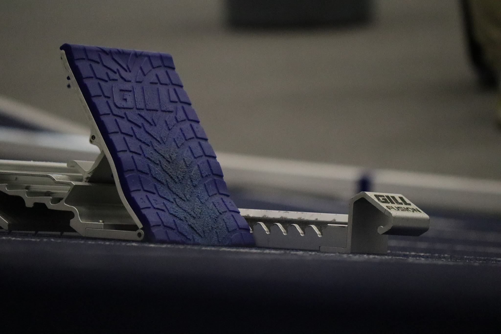
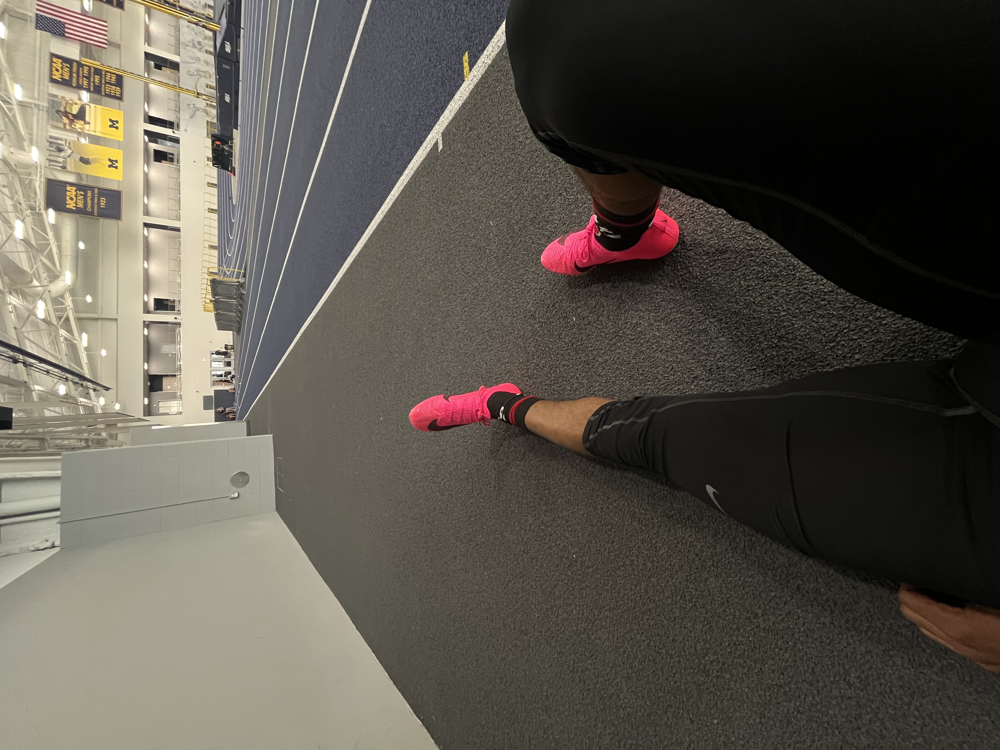
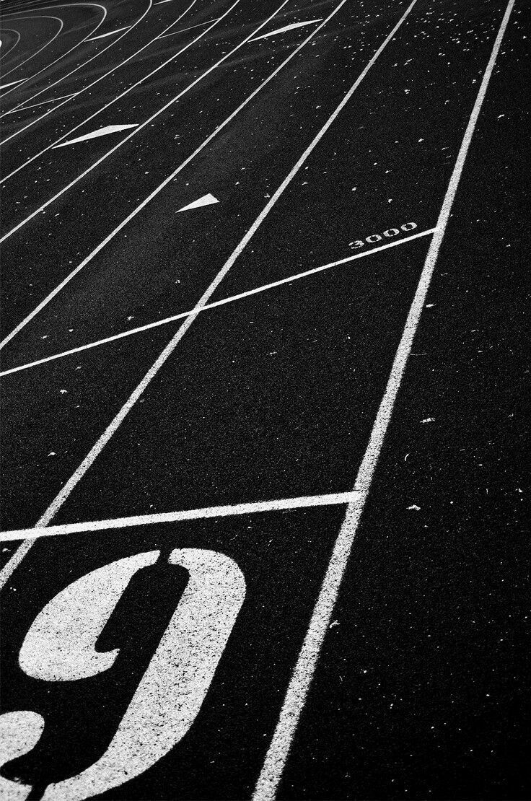

<html lang="en">
<head>
    <meta charset="UTF-8">
    <meta name="viewport" content="width=device-width, initial-scale=1.0">
    <title>Track & Field Photo Essay</title>
    
</head>
<body>
    <header>Track & Field: The Race Within</header>
    

        <h2>Photo Gallery</h2>
        
A journey through the passion, speed, and resilience of track & field.

        

            

                
                
The Beginning

            

            

                
                
No Days Off

            

            

                
                
Tools of Speed

            

            

                
                
The Adrenaline

            

            

                
                
Flight Mode

            

            

                
                
Crossing Over

            

            

                
                
Every Second Counts

            

            

                
                
Brotherhood / Sisterhood

            

            

                
                
The Highs and Lows

            

            

                
                
The Next Lap

            

        

    

</body>
</html>
